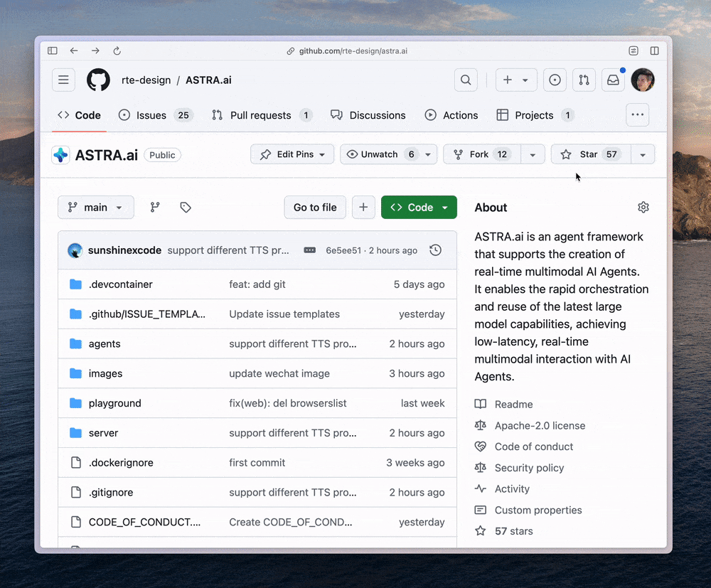

# 🌟 Welcome to TEN

Welcome to TEN! TEN stands for Transformative Extensions Network, an open-source framework for quickly creating multimodal AI agents. It features the all-in-one TEN Manager, written in Rust, supports multimodal protocols, includes the TEN Runtime, offers the Graph Designer, and has an Extension Store to share in community.

Here, you’ll get an overview of all the incredible features TEN offers to help you build engaging and interactive experiences.

Before we get started, please click the [**star button on our GitHub repo**](https://github.com/rte-design/astra.ai) to stay updated with one of the AI agents powered by TEN.

<figure><figcaption>
Star us to stay updated
</figcaption></figure>

### Jump right in

<table data-view="cards"><thead><tr><th></th><th></th><th data-hidden data-card-cover data-type="files"></th><th data-hidden></th><th data-hidden data-card-target data-type="content-ref"></th></tr></thead><tbody><tr><td><strong>Getting started</strong></td><td>Quickstart to build locally</td><td><a href="assets/png/1.png">1.png</a></td><td></td><td><a href="getting_started/quickstart.md">quickstart.md</a></td></tr><tr><td><strong>Customize agent</strong></td><td>Two ways to customize</td><td><a href="assets/png/4.png">4.png</a></td><td></td><td><a href="getting_started/publish_your_docs.md">publish_your_docs.md</a></td></tr><tr><td><strong>Create hello world extension</strong></td><td>Build extensions right away</td><td><a href="assets/png/3.png">3.png</a></td><td></td><td><a href="getting_started/create_a_hello_world_extension.md">create_a_hello_world_extension.md</a></td></tr></tbody></table>
