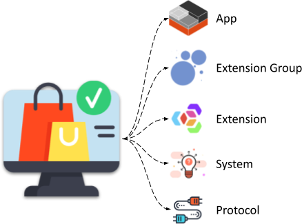

# 云商店

TEN 云商店类似于 Android 上的 Google Play 和 iOS 上的 App Store，提供各种 TEN 软件包。 可以将这些软件包下载到 TEN 应用程序中，以帮助和增强开发。

<figure><figcaption>
TEN 云商店
</figcaption></figure>

## 数据库中存储的 TEN 软件包的信息

1. **软件包类型**

    表示软件包类型的字符串，例如 `extension`。

2. **软件包名称**

    表示软件包名称的字符串，例如 `builtin_extension`。

3. **软件包版本**

    遵循语义版本控制 (semver) 的字符串，用于指定软件包版本，例如 `3.0.0`。

4. **依赖项**

    对象数组，每个对象包含以下字段：

    * **软件包类型**

        字符串，与顶级的 `package type` 匹配。

    * **软件包名称**

        字符串，与顶级的 `package name` 匹配。

    * **版本**

        遵循 semver 的字符串，用于指定软件包的版本要求，例如 `~3.0.0`。
