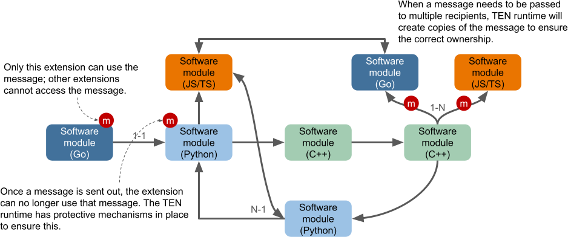

# 消息系统

## 消息类型

在 TEN 框架中，消息被分为四种类型：

1. 命令 (Command)
2. 数据 (Data)
3. 视频帧 (Video Frame)
4. 音频帧 (Audio Frame)

命令和非命令消息类型之间的主要区别在于，命令会产生结果，而非命令则不会。

与这些类型相对应，扩展有四个消息回调函数：

1. `OnCmd`
2. `OnData`
3. `OnVideoFrame`
4. `OnAudioFrame`

以下是 TEN 框架消息的分类图：

```text
┌── 有结果
│   └── 命令 (Command)
│       ├── TEN 框架内置命令
│       │    => 消息名称以 `ten:` 开头
│       └── 非 TEN 框架内置命令
│            => 消息名称不以 `ten:` 开头
└── 无结果
    ├── 数据 (Data)
    │   ├── TEN 框架内置数据
    │   │    => 消息名称以 `ten:` 开头
    │   └── 非 TEN 框架内置数据
    │        => 消息名称不以 `ten:` 开头
    ├── 视频帧 (Video Frame)
    │   ├── TEN 框架内置视频帧
    │   │    => 消息名称以 `ten:` 开头
    │   └── 非 TEN 框架内置视频帧
    │        => 消息名称不以 `ten:` 开头
    └── 音频帧 (Audio Frame)
        ├── TEN 框架内置音频帧
        │    => 消息名称以 `ten:` 开头
        └── 非 TEN 框架内置音频帧
             => 消息名称不以 `ten:` 开头
```

## 消息名称

在 TEN 框架中，消息名称用于区分相同类型但用途不同的消息。扩展使用不同的消息名称来决定它们需要执行的操作。

消息名称的命名规则如下：

1. 第一个字符必须是字母 (`a-z`、`A-Z`) 或下划线 (`_`)。
2. 后续字符可以是字母 (`a-z`、`A-Z`)、数字 (`0-9`) 或下划线 (`_`)。

## 消息流

<figure><figcaption><p>消息流</p></figcaption></figure>

TEN 框架支持三种消息流模式：

1. **单消息，单结果：**

   适用于一个动作产生单个结果的情况。
2. **单消息，多结果：**

   适用于一个动作产生多个结果的情况。
3. **多消息：**

   适用于不需要结果的动作。

## 扩展的消息接口

扩展的 `manifest.json` 文件中的 `api` 字段定义了该扩展的外部消息接口。`api` 字段可以包含以下类型的 API 信息：

* `cmd_in`
* `cmd_out`
* `data_in`
* `data_out`
* `audio_frame_in`
* `audio_frame_out`
* `video_frame_in`
* `video_frame_out`

以下是一个 API 定义的示例：

```json
{
  "api": {
    "cmd_in": [
      {
        "name": "cmd_foo",
        "property": {
          "foo": {
            "type": "int8"
          },
          "bar": {
            "type": "string"
          }
        },
        "result": {
          "property": {
            "aaa": {
              "type": "int8"
            },
            "bbb": {
              "type": "string"
            }
          }
        }
      }
    ],
    "cmd_out": [],
    "data_in": [
      {
        "name": "data_foo",
        "property": {
          "foo": {
            "type": "int8"
          },
          "bar": {
            "type": "string"
          }
        }
      }
    ],
    "data_out": [],
    "video_frame_in": [],
    "video_frame_out": [],
    "audio_frame_in": [],
    "audio_frame_out": []
  }
}
```

TEN 框架中不同扩展之间的消息配对机制类似于传统编程语言中的函数调用。以下是一个简单的类比：

1. 消息名称类似于函数名称，扩展消息之间的配对机制类似于函数调用机制。
2. 消息属性类似于函数参数。
3. 当 TEN 框架确定扩展 A 的输出消息 `foo` 与扩展 B 的输入消息 `foo` 配对时，这类似于扩展 A 中的函数指针指向扩展 B 中的函数 `foo`。
4. 配对仅基于消息名称，而不是消息属性。这意味着 TEN 框架不支持类似于函数重载的机制。

因此，消息名称对于每个扩展的输入/输出消息至关重要，充当该扩展的控制平面接口。

尽管 TEN 框架在单消息级别提供了与语言无关的调用机制，但它还允许通过 TEN 模式对扩展之间的调用关系进行静态和动态检查。这有助于检测潜在问题，例如源扩展和目标扩展之间对属性类型的不同解释。用户可以定义自己的消息名称，并通过图确定扩展之间的调用关系。TEN 框架还提供了静态检查工具，以确保这些关系不会导致任何问题。

## TEN 框架中的消息所有权概念

在 TEN 框架中，一旦消息成功发送，发送消息的扩展将无法再使用它。此概念对于维护框架内的消息安全和线程安全至关重要。

<figure><figcaption><p>消息处理遵循所有权概念</p></figcaption></figure>

消息可以沿两个方向发送：**发送 (send)** 和 **返回 (return)**。只有命令消息具有返回方向；数据、音频帧和视频帧消息则没有。消息发送后，可能会经过各种处理步骤，允许扩展继续使用该消息可能会导致线程安全问题。例如，处理消息的另一个扩展可能在不同的线程中运行。即使初始扩展继续使用该消息没有任何明显问题，此行为也是未定义的，开发人员不应依赖它。

TEN 运行平台实施了各种安全措施，以确保扩展在消息成功发送后无法使用该消息。

### 消息所有权转移至扩展

当 TEN 框架通过 `OnCmd`、`OnData`、`OnVideoFrame` 或 `OnAudioFrame` 回调函数将消息传递给扩展时，框架会将消息的所有权转移给该扩展。这种所有权的转移意味着 TEN 框架保证只有接收扩展才能访问该消息，从而确保消息安全和线程安全。该扩展可以自由使用该消息，并且在不再需要该消息时必须将所有权返回给 TEN 框架。返回所有权后，该扩展不得再与该消息进行任何交互。

### 消息所有权转移至 TEN 运行平台

当扩展使用 `SendCmd`、`ReturnResult`、`SendData`、`SendVideoFrame` 或 `SendAudioFrame` 等 API 将消息发送回 TEN 运行平台时，该扩展会将消息的所有权返回给 TEN 运行平台。

### 与消息相关的数据的所有权

所有权的概念不仅限于消息本身，还延伸到与该消息关联的所有资源。与消息一样，每个资源的所有权一次只能属于一个扩展，并且它反映了消息的所有权。这种设计确保了 TEN 框架中的消息和线程安全。

例如，如果扩展 A 拥有一个消息并使用该消息中的缓冲区，则它必须在不再需要它们的时候将消息和缓冲区的所有权都返回给 TEN 运行平台。

### 默认复制语义

为了防止多个扩展同时处理同一资源而导致数据竞争等问题，TEN 框架在跨 TEN 运行平台和扩展边界传输数据时默认使用**复制语义**。复制确保了所有权的分离，从而维护安全性。

### 借用语义

TEN 框架还支持**借用语义**，允许扩展使用资源而无需取得所有权。这种方法在保持消息和线程安全的同时，提高了资源的利用率。借用 API 必须与 GiveBack API 结合使用，以确保资源的安全性和完整性。

当扩展将消息的所有权返回给 TEN 运行平台时，如果所有关联的资源也已返回，则运行平台才会接受该消息。例如，如果扩展 A 借用了数据消息的缓冲区，但在返回消息本身之前没有返回缓冲区的所 有权，则 TEN 运行平台将拒绝该消息（例如，`SendData` 将会失败）。

### 借用 API

扩展可以使用借用 API 直接访问消息中的资源，从而实现临时使用而无需转移所有权。

### GiveBack API

GiveBack API 用于将资源的所有权返回给 TEN 运行平台，确保资源得到安全管理并在不再需要时被释放。

## 命令

TEN 客户端和 TEN 扩展可以向其他 TEN 扩展发送命令。

如果命令用于不需要结果的场景，则没有问题。TEN 运行平台将自动丢弃任何不必要的结果。

### 结果

结果是对命令的响应。例如，当 TEN 扩展 A 向 TEN 扩展 B 发送命令 X 时，在处理完该命令后，TEN 扩展 B 会将结果发送回 TEN 扩展 A。结果可以包含任何有意义的细节，使 TEN 扩展 A 能够获得有关执行结果的更多信息。

一个典型的结果的 JSON 表示形式可能如下所示：

```json
{
  "_ten": {
    "status_code": 400
  }
}
```
