# TEN Designer

TEN framework 极具弹性, 提供了很多功能, 包括 TEN 云商店, 多语言支持, 多平台支持等等. 但这些功能可能需要较多的学习时间及较高的学习门槛才能较好的操作 TEN framework 来完成想要的 AI agent 开发及客制化. 因此为了方便开发者, TEN framework 提供了一个基于 web 的可视化开发工具, 名叫 TEN designer, 提供了丰富的功能来帮助开发者开发和调试 TEN apps 及 TEN extension.

可以在底下的网址取得 TEN designer:

```text
https://github.com/TEN-framework/TEN-Designer/releases
```

TEN designer 支援底下的操作系统及架构, 根据你的平台取得对应的版本.

- Windows
  - x86_64
- Linux
  - x86_64
- MacOS
  - x86_64
  - arm64

下载后解压, 要启动 TEN designer, 请使用以下命令:

```shell
tman designer
```

你可以在一个 TEN app 的根目录下执行上列命令, 也可以在任何地方执行. 如果在一个 TEN app 的根目录下执行, 则 TEN designer 会默认将该 TEN app 载入到 TEN designer 中. 或者也可以在 TEN designer 中手动的载入任何的 TEN app. 因此这个在某一个 TEN app 的根目录下启动 TEN designer 并不是一个必须的动作, 不过可以利用这个功能来简化 TEN designer 一开始的手动载入 TEN app 的动作.

启动后可以看到如下的讯息, 代表 TEN designer 默认在端口 49483 上启动:

```text
🏆  Starting server at http://0.0.0.0:49483
```

您可以使用以下 URL 与 TEN designer 交互:

```text
http://127.0.0.1:49483/
```

> Note: 如果您的 TEN designer 是运行在远程机器上, 请使用远程机器的 IP 地址来访问 TEN designer.

## 概观

使用浏览器打开 TEN designer 的页面后, 会看到如下的画面:

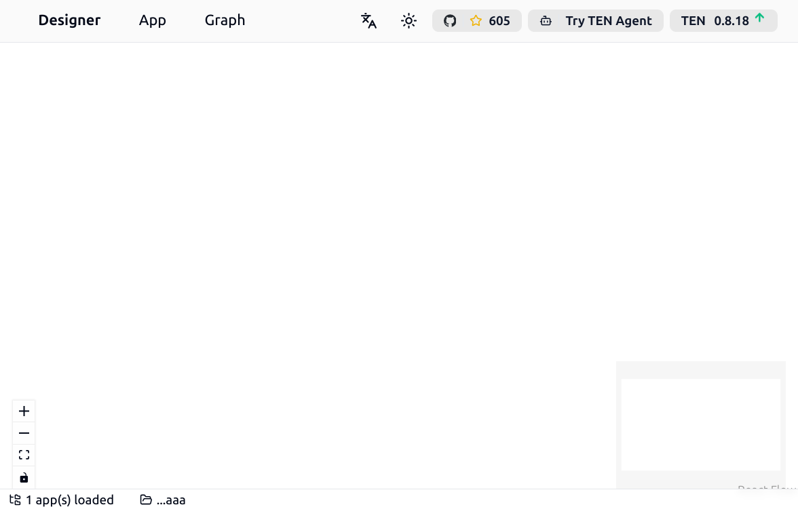

在 TEN designer 中的右上方可以看到几个按钮:

- 最右边的按钮会显示当前的 TEN designer 的版本号, 并且会自动侦测有没有新的版本发布, 如果有的化, 会显示一个向上的箭头, 点击后会开启新版本的下载页面.
- 左边一点的按钮是 [TEN Agent](https://agent.theten.ai/) 按钮, 点击后会开启 TEN Agent 的页面. TEN Agent 是使用 TEN framework 的一个完整的 AI agent 的实现, TEN designer 的目标之一是可以让开发者轻松的透过 TEN designer 来开发和调试及客制化 TEN Agent.
- 再左边一点的按钮是 [TEN framework](https://github.com/TEN-framework/ten_framework) 的 github 页面, 点击后会开启 TEN framework 的 github 页面. 如果想要了解更多关于 TEN framework 的讯息及源代码, 或者是提 issue, 可以到这个页面.
- 再左边一点有两个按钮, 分别可以切换亮暗模式, 以及选择语言.

在 TEN designer 的左上方有几个下拉选单, 开发者可以透过这边来使用 TEN designer 的各项功能.

## 处理 TEN App

### 载入已有的 TEN app

透过 App 选单的 Load App 按钮, 可以载入已有的 TEN app. 按下按钮后, 会看到如下的画面:

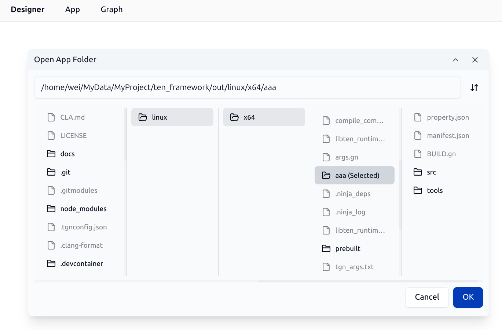

透过这个 file explorer dialog, 开发者可以指定已有的 TEN app 的根目录来载入已有的 TEN app.

### 管理已经载入的 TEN app

透过 App 选单的 Manage Loaded App(s) 按钮, 可以管理已经载入的 TEN app. 按下按钮后, 会看到如下的 Apps Manager 画面:

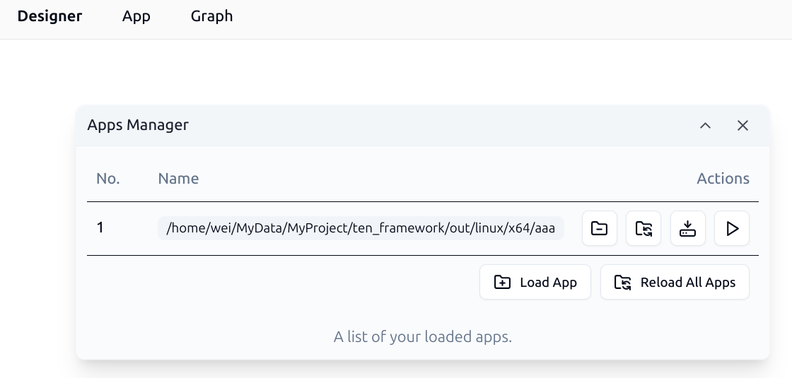

开发者可以借由这个 dialog 来:

- 卸载已经载入的 TEN app
- 重新载入指定的 TEN app
- 重新载入所有已经载入的 TEN app
- 安装指定 App 的所有依赖
- 运行指定 App 的功能

### 安装指定 App 的所有依赖

在 Apps Manager 中, 可以对指定的 App 进行 Install All 的动作, 这个动作用来安装指定的 App 的所有依赖. 按下按钮后, 会看到如下的画面, 会显示安装所有依赖的过程.

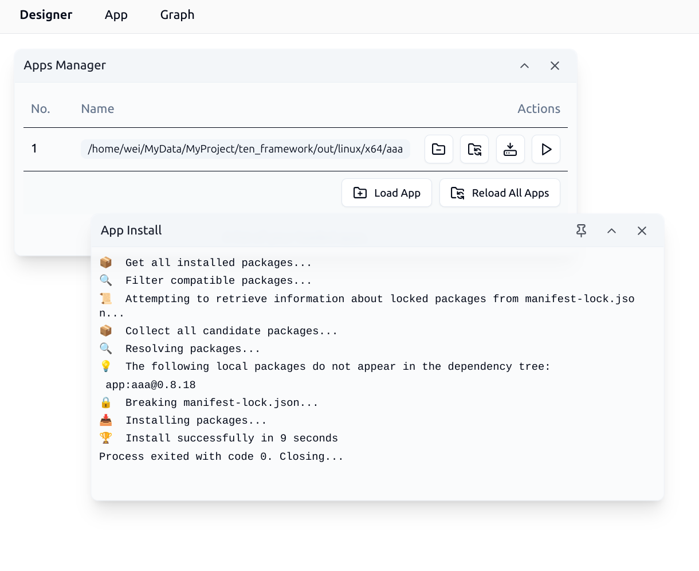

### 从云商店安装 TEN extension

透过 Graph 选单的 Open Extension Store 按钮, 可以打开 TEN 云商店, 并从 TEN 云商店安装 TEN extension 到当前的 TEN app. 按下按钮后, 会看到如下的画面:

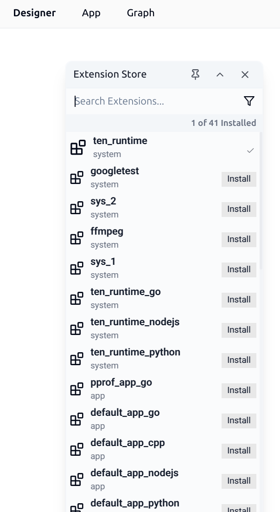

在 TEN 云商店中, 开发者可以搜寻想要的 TEN extension, 并且按下 Install 按钮来安装到当前的 TEN app. 安装完成后, 可以在当前的 TEN app 中看到安装的 TEN extension.

### 运行 TEN app

在 Apps Manager 中, 可以对指定的 App 进行该 App 预先设定好的运行动作, 在 Apps Manager 中点击 Run 按钮后, 会看到如下的画面:

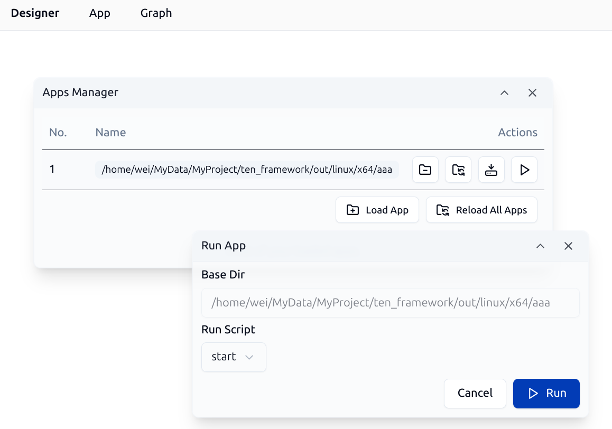

在 Dialog 中, 开发者可以从下拉选单中选择想要进行 App 预先设定好的哪个动作. 通常会有几种动作:

- 运行 App : 把 App 运行起来, 并且把 App 的输出讯息显示在 TEN designer 的讯息视窗中.
- 编译 App : 对 App 进行编译. 由于 TEN framework 支持很多语言, 有些语言需要编译, 有些语言不需要编译, 例如以 C++ 开发的 TEN app 就需要编译, 而以 Python 开发的 TEN app 则不需要编译.

底下是一个以 C++ 开发的 TEN app 的编译画面:

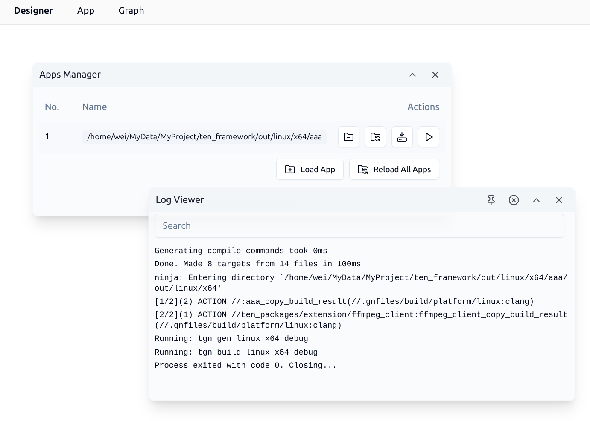

编译完成后, 可以继续进行 TEN app 的启动动作:

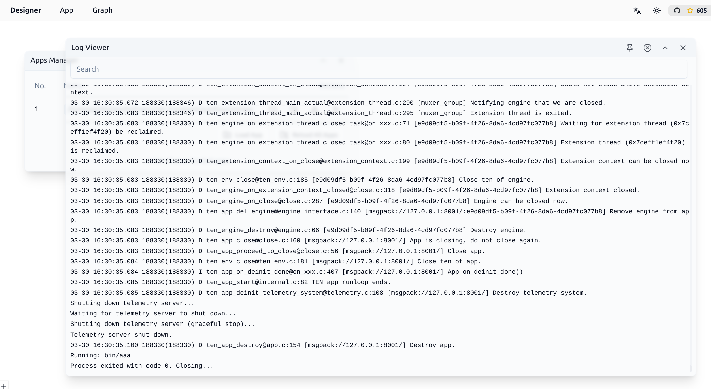

## 处理 TEN Graph

### 载入已有的 TEN graph

透过 Graph 选单的 Open Existing Graph 按钮, 可以载入已有的 TEN graph. 载入 Graph 成功后, 会看到类似如下的画面:

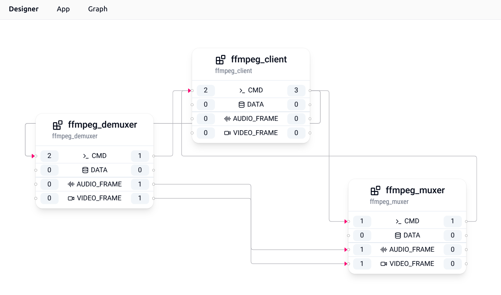

以这个 graph 来说, 它具有 3 个 TEN extensions, 分别是:

- `ffmpeg_demuxer`
- `ffmpeg_muxer`
- `ffmpeg_client`

每个 TEN extension 都有其对应的输入及输出, 以 `ffmpeg_demuxer` 来说, 它具有底下的输入与输出:

- 2 个 cmd 输入
- 1 个 cmd 输出
- 1 个 audio_frame 输出
- 1 个 video_frame 输出

点击输入输出的数字按钮, 可以打开如下的 dialog, 来管理输入输出的连接:

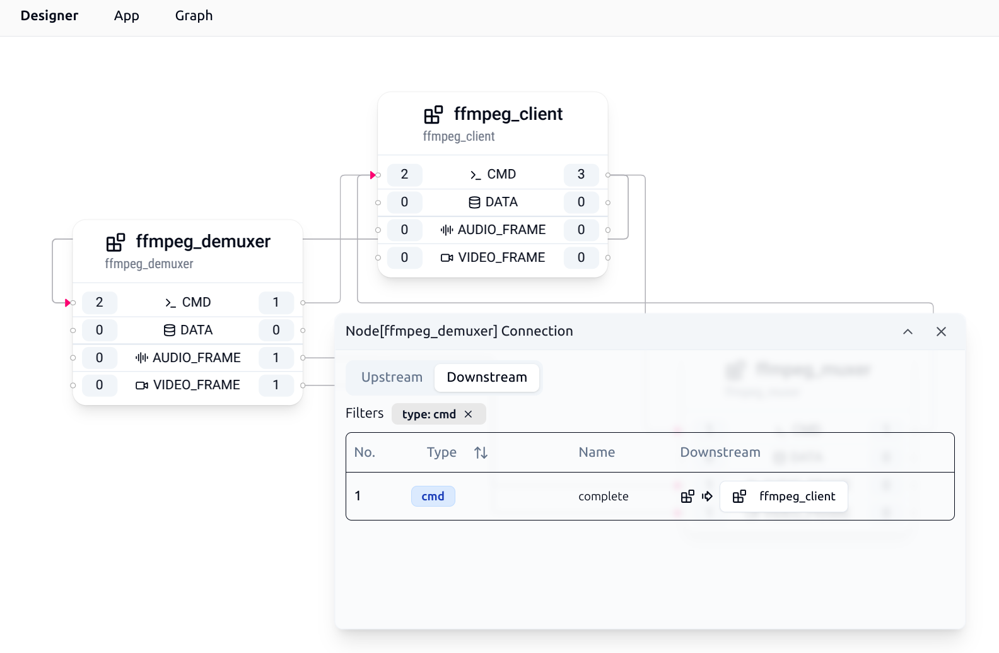

### 自动排布 Graph

当开发者手动调整 TEN graph 中的 TEN extension 的位置后, 可以点击 Graph 选单内的 Auto Layout 按钮, 来自动排布 TEN graph 中的 TEN extension.

### 开启 TEN extension 的 context menu

在 Graph 内, 对每一个 TEN extension 都可以按滑鼠右键, 开启 TEN extension 的 context menu.

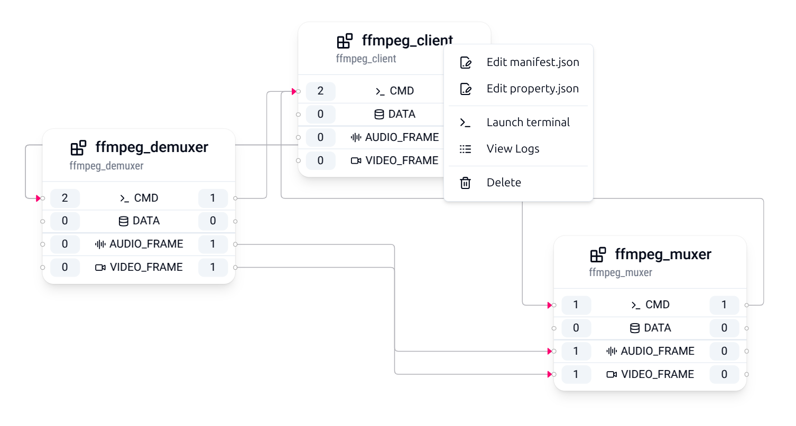

在 context menu 中, 可以开启 TEN extension 的 manifest.json 文件, 也可以开启 TEN extension 的 property.json 文件, 也可以直接在 TEN extension 的根目录下启动一个 terminal 方便开发者对那个 TEN extension 进行修改以及客制化:

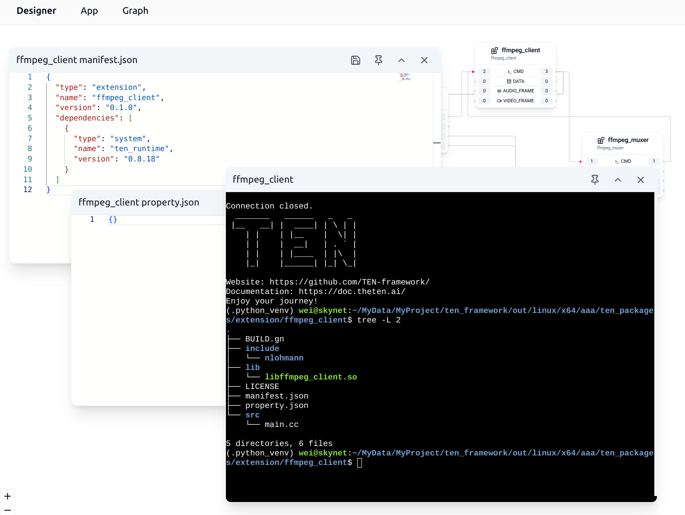
