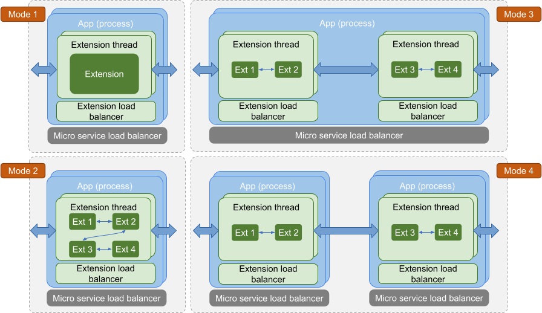

# 应用程序

应用程序是 TEN 世界中的容器，包含组和扩展。
应用程序可以作为放置在 Docker 容器内的进程（主要在云中使用）。
应用程序也可以作为嵌入在现有应用程序内的线程（在客户端或服务器上）。
⇒ TEN 可以在现有项目上执行本地化修改（小幅增强），而无需根据 TEN 重写整个项目。

<figure><figcaption>
将 TEN 作为进程或线程运行
</figcaption></figure>

<figure><figcaption>
应用程序运行的不同模式
</figcaption></figure>

## TEN 应用程序文件夹结构

在 TEN 框架中，开发人员可以使用各种编程语言创建 TEN 软件包。无论使用哪种语言，TEN 应用程序的整体文件夹结构都保持一致，确保不同实现之间的一致性。

<figure><figcaption>
TEN 软件包文件夹结构
</figcaption></figure>
