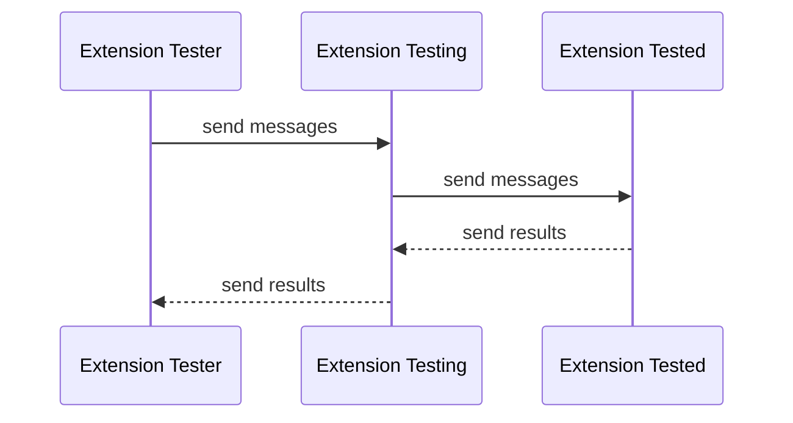

# 适用于 TEN 框架的用户

## 扩展的独立测试

TEN 框架提供了一种独立的扩展测试机制。该机制允许开发者在不依赖其他 TEN 概念（例如其他 TEN 扩展、TEN 图或 TEN 应用）的情况下测试扩展。当开发者需要在不运行整个 TEN 应用的情况下测试扩展的行为时，这种独立的扩展测试机制尤其有用。

TEN 扩展的独立测试框架遵循两个关键原则：

1. **与所用语言的任何原生测试框架兼容。**

   例如，如果使用 C++ 开发 TEN 扩展，则 Google gtest/gmock 测试框架可以与 TEN 扩展独立测试框架一起使用，以实现 C++ TEN 扩展的独立测试。
2. **用户无需修改被测扩展中的任何代码。**

   可以使用此独立测试框架对运行时使用的完全相同的扩展代码进行全面测试。
3. **以不同语言开发的扩展的独立测试流程遵循相同的设计原则和使用方法。**

   这确保一旦您学习了一种语言的独立测试概念和方法，就可以快速掌握其他语言的 TEN 扩展的独立测试概念和方法。

对于用户来说，TEN 扩展独立测试框架引入了两个主要概念：

1. **`extension_tester`**
2. **`ten_env_tester`**

`extension_tester` 的作用类似于一个测试驱动程序，负责设置和执行整个测试过程。另一方面，`ten_env_tester` 的行为类似于典型的 TEN 扩展的 `ten_env` 实例，使用户能够从 `extension_tester` 的回调中调用独立测试框架中的功能，例如向被测扩展发送消息和从被测扩展接收消息。

从 `extension_tester` 和 `ten_env_tester` 的 API 设计中，您可以看到它们与 **TEN 扩展** 和 `ten_env` 非常相似，这是有意为之的。主要目的是让熟悉扩展开发的用户能够快速适应独立测试框架，然后为扩展本身开发独立的测试用例。

然而，出于测试目的，不可避免地会有专门用于测试的 API 和功能。为了防止这些在实际运行时不需要的、专用于测试的功能和 API 污染运行平台 API 集，独立测试框架被设计为不直接使用或扩展 **extension** 和 `ten_env` 的 API 集。相反，它引入了独立于测试的类型和 API 集。这种分离确保了实际运行时使用的类型和 API 集与测试期间使用的类型和 API 集互不干扰，避免了任何负面影响。

## 独立测试框架内部机制

在内部，TEN 扩展独立测试框架会隐式启动一个测试应用，加载要测试的扩展插件（我们称之为扩展 A），并初始化一个包含要测试的扩展 A 和另一个专门用于测试其他扩展的扩展（我们称之为扩展 B）的图。扩展 A 的所有输入和输出消息都被重定向到扩展 B，允许用户在测试过程中自定义输入和输出，并完成实际的测试工作。



基本上，您可以将此隐藏在测试框架中的测试扩展视为被测试扩展和测试器之间的代理。它充当 TEN 图中的代理扩展，使用 TEN 环境的语言促进被测扩展和测试器之间的消息交换。

## 基本测试流程

基本测试流程和逻辑如下：

1. 创建一个扩展测试器来管理整个独立测试过程。
2. 向独立测试框架提供包含待测扩展的文件夹信息。
3. 设置测试模式，例如用于测试单个扩展的模式。
4. 开始测试。

## C++

以下是使用 Google gtest 进行 TEN 扩展独立测试的示例：

```c++
class extension_tester_basic : public ten::extension_tester_t {
 public:
  void on_start(ten::ten_env_tester_t &ten_env) override {
    auto new_cmd = ten::cmd_t::create("hello_world");
    ten_env.send_cmd(std::move(new_cmd),
                     [](ten::ten_env_tester_t &ten_env,
                        std::unique_ptr<ten::cmd_result_t> result) {
                       if (result->get_status_code() == TEN_STATUS_CODE_OK) {
                         ten_env.stop_test();
                       }
                     });
  }
};

TEST(Test, Basic) {
  // 1. Create an extension tester to manage the entire standalone testing process.
  auto *tester = new extension_tester_basic();

  // 2. Set a testing mode, such as a mode for testing a single extension.
  tester->set_test_mode_single("default_extension_cpp");

  // 3. Start the testing.
  tester->run();

  delete tester;
}
```

## Golang

TODO: 待补充。

## Python

```python
class ExtensionTesterBasic(ExtensionTester):
    def check_hello(self, ten_env: TenEnvTester, result: CmdResult):
        statusCode = result.get_status_code()
        print("receive hello_world, status:" + str(statusCode))

        if statusCode == StatusCode.OK:
            ten_env.stop_test()

    def on_start(self, ten_env: TenEnvTester) -> None:
        new_cmd = Cmd.create("hello_world")

        print("send hello_world")
        ten_env.send_cmd(
            new_cmd,
            lambda ten_env, result: self.check_hello(ten_env, result),
        )

        print("tester on_start_done")
        ten_env.on_start_done()


def test_basic():
    # 1. Create an extension tester to manage the entire standalone testing process.
    tester = ExtensionTesterBasic()

    # 2. Set a testing mode, such as a mode for testing a single extension.
    tester.set_test_mode_single("default_extension_python")

    # 3. Start the testing.
    tester.run()
```
