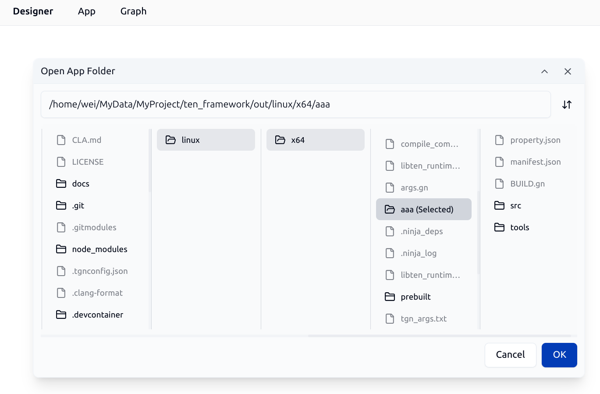
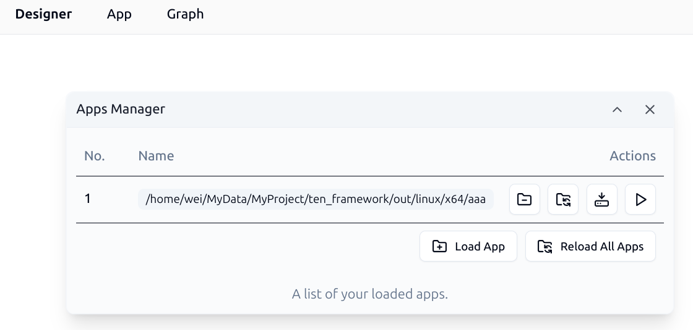
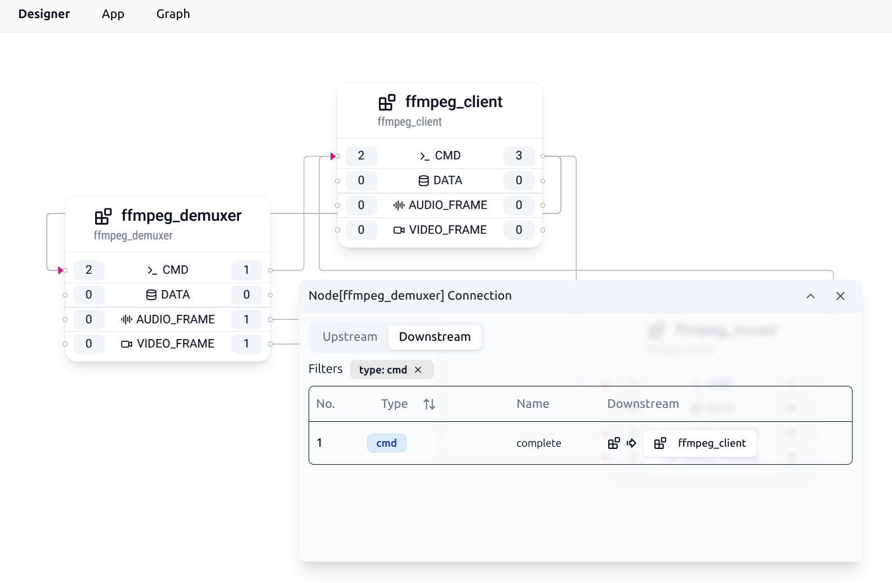

# TEN Designer

TEN Framework offers high flexibility and provides rich functionalities, including TEN Cloud Store, package management, multi-language support, and multi-platform support. However, these features may require a longer learning period and higher technical threshold to master TEN Framework for AI Agent development and customization. To facilitate developers' use, TEN Framework provides a command-line tool called TEN Manager, which enables developers to easily modify and customize AI Agents built with TEN Framework.

Since command-line tools are not as user-friendly as graphical user interfaces, TEN Manager includes a web UI-based visual development interface called TEN Designer, in addition to the command-line interface. It provides rich functionality to help developers develop and debug TEN Apps and TEN Extensions. This means that developers only need to obtain the TEN Manager tool to access a complete TEN Framework development environment with both command-line and graphical user interfaces.

You can get TEN Designer from the following link:

```text
https://github.com/TEN-framework/TEN-Designer/releases
```

TEN Designer supports the following operating systems and architectures. Please obtain the appropriate version for your platform:

- Windows
  - x86_64
- Linux
  - x86_64
- MacOS
  - x86_64
  - arm64

After downloading and extracting, use the following command to start TEN Designer:

```shell
tman designer
```

You can execute this command in the root directory of any TEN App, or in any location. If executed in the root directory of a TEN App, TEN Designer will load that TEN App by default. You can also manually load any TEN App in TEN Designer. Therefore, starting TEN Designer in the root directory of a specific TEN App is not mandatory, but it simplifies the initial step of manually loading a TEN App.

After startup, you will see information like the following, indicating that TEN Designer starts on port 49483 by default:

```text
🏆  Starting server at http://0.0.0.0:49483
```

You can interact with TEN Designer using the following URL:

```text
http://127.0.0.1:49483/
```

> Note: If your TEN Designer is running on a remote machine, please use the IP address of the remote machine to access TEN Designer.

## Overview

After opening the TEN Designer page in your browser, you will see the following interface:


In the upper right corner of TEN Designer, you can see several function buttons:

- The rightmost button displays the current version of TEN Designer and automatically checks for new version releases. If an update is available, an upward arrow will be displayed. Clicking it will open the download page for the new version.
- The first button on the left is the [TEN Agent](https://agent.theten.ai/) button. Clicking it will open the TEN Agent page. TEN Agent is a complete AI Agent implementation built using TEN Framework. One of the main goals of TEN Designer is to enable developers to easily develop, debug, and customize TEN Agent through TEN Designer.
- The second button on the left is the [TEN Framework](https://github.com/TEN-framework/ten_framework) GitHub page. Clicking it will open the GitHub repository for TEN Framework. You can visit this page to learn more about TEN Framework, view source code, or submit issues.
- On the far left, there are two buttons for switching between light and dark modes and selecting languages.

In the upper left corner of TEN Designer, there are several dropdown menus that developers can use to access various functions of TEN Designer.

## Working with TEN Apps

### Loading an Existing TEN App

You can load an existing TEN App using the Load App button in the App menu. After clicking the button, you will see the following interface:



Through this file browser dialog, developers can specify the root directory of an existing TEN App to load it.

### Managing Loaded TEN Apps

You can manage loaded TEN Apps using the Manage Loaded App(s) button in the App menu. After clicking the button, you will see the following Apps Manager interface:



Developers can use this dialog to:

- Unload loaded TEN Apps
- Reload specified TEN Apps
- Reload all loaded TEN Apps
- Install all dependencies for specified Apps
- Run functions for specified Apps

### Installing All Dependencies for an App

Developers can install various TEN packages in a TEN App. All TEN packages that a TEN App depends on are recorded in the `manifest.json` file. Here is an example of a `manifest.json` file:

```json
{
  "type": "app",
  "name": "aaa",
  "version": "0.8.18",
  "dependencies": [
    {
      "type": "system",
      "name": "ten_runtime",
      "version": "0.8.18"
    },
    {
      "type": "extension",
      "name": "ffmpeg_muxer",
      "version": "^0.1.0"
    },
    {
      "type": "extension",
      "name": "ffmpeg_demuxer",
      "version": "^0.1.0"
    },
    {
      "type": "extension",
      "name": "ffmpeg_client",
      "version": "^0.1.0"
    },
    {
      "type": "protocol",
      "name": "msgpack",
      "version": "^0.8.18"
    }
  ],
  "scripts": {
    "start": "python3 tools/run_script.py start",
    "build": "python3 tools/run_script.py build"
  }
}
```

From the above configuration, we can see that this TEN App depends on the following TEN packages:

- `ten_runtime`: The system package of TEN Framework
- `ffmpeg_demuxer`: A TEN Extension package for decoding audio and video
- `ffmpeg_muxer`: A TEN Extension package for encoding audio and video
- `ffmpeg_client`: A TEN Extension package for processing audio and video using the other two ffmpeg extension packages
- `msgpack`: A TEN Protocol package for message serialization and deserialization using the MessagePack protocol

After completing the installation of all dependencies for the TEN App, the TEN package file structure in the system looks like this:

```text
├── ten_packages
│   ├── extension
│   │   ├── ffmpeg_client
│   │   ├── ffmpeg_demuxer
│   │   └── ffmpeg_muxer
│   ├── protocol
│   │   └── msgpack
│   └── system
│       ├── ffmpeg
│       └── ten_runtime
```

It's worth noting that even though it's not explicitly declared in the `manifest.json`, there is an additional `ffmpeg` system package in the system. This is because `ffmpeg_demuxer` and `ffmpeg_muxer` depend on the `ffmpeg` system package, and TEN Manager automatically identifies and installs these transitive dependencies.

Through the Apps Manager interface in TEN Designer, developers can perform the Install All operation on a specified App to easily complete the installation of all dependencies. After clicking the button, you will see the following interface showing the installation progress:


### Installing TEN Extensions from the Cloud Store

You can open the TEN Cloud Store and install TEN Extensions to the current TEN App using the Open Extension Store button in the Graph menu. After clicking the button, you will see the following interface:


In the TEN Cloud Store, developers can search for the required TEN Extensions and click the Install button to install them to the current TEN App. After installation, you can view the installed TEN Extensions in the current TEN App.

### Running a TEN App

In the Apps Manager, you can perform preset runtime operations on the specified App. After clicking the Run button in the Apps Manager, you will see the following interface:


In the dialog, developers can select the preset operation to execute from the dropdown menu. These typically include the following operations:

- Run App: Start the App and display the App's output information in the TEN Designer message window.
- Build App: Compile the App. Since TEN Framework supports multiple programming languages, some languages need to be compiled while others do not. For example, TEN Apps developed in C++ need to be compiled, while TEN Apps developed in Python do not.

Below is the build interface for a TEN App developed in C++:


After the build is complete, you can continue with the startup operation for the TEN App. The system will display a window showing the TEN App's runtime logs in real-time:


## Working with TEN Graphs

### Loading an Existing TEN Graph

You can load an existing TEN Graph using the Open Existing Graph button in the Graph menu. After successful loading, you will see an interface similar to the following:


Using this Graph as an example, it contains 3 TEN Extensions, namely:

- `ffmpeg_demuxer`
- `ffmpeg_muxer`
- `ffmpeg_client`

Each TEN Extension has its corresponding inputs and outputs. For example, `ffmpeg_demuxer` has the following inputs and outputs:

- 2 cmd inputs
- 1 cmd output
- 1 audio_frame output
- 1 video_frame output

Clicking on the number buttons for inputs and outputs opens a dialog like the following, which is used to manage input and output connections:



### Auto-Layout Graph

After manually adjusting the positions of TEN Extensions in the TEN Graph, developers can click the Auto Layout button in the Graph menu to automatically arrange the TEN Extensions in the TEN Graph.

### Opening the Context Menu for TEN Extensions

In the Graph, right-clicking on each TEN Extension opens the TEN Extension's context menu:


In the context menu, you can open the TEN Extension's `manifest.json` file, `property.json` file, or directly start a terminal in the root directory of the TEN Extension, making it convenient for developers to modify and customize the TEN Extension:


