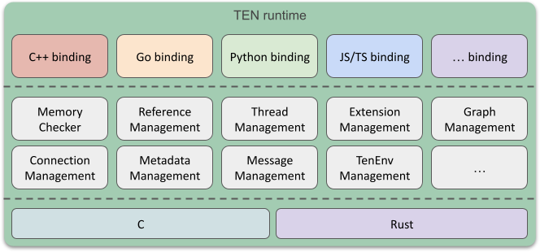
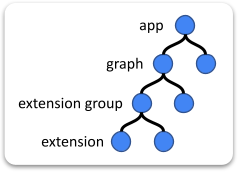
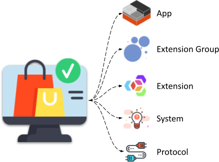

# TEN 框架概念概述

<figure><figcaption>
TEN 框架
</figcaption></figure>

## TEN 运行时

TEN 运行时是一种执行环境，旨在运行 TEN 框架内的应用程序。 它提供了一个灵活的架构，支持以多种编程语言开发的扩展，并处理各种类型的数据流。 通过管理扩展、数据流和线程的生命周期，TEN 运行时为开发人员提供了一个强大的工具，用于构建各种应用程序和服务。

## 应用（App）

TEN 框架中的应用可以作为独立的进程运行，也可以作为现有进程中的线程运行。 这种灵活性允许根据应用程序的需求选择不同的部署选项。

## 扩展组（Extension Group）

扩展组是一种为执行指定特定线程的机制。 给定组中的所有扩展都在同一线程上执行，从而确保一致和同步的处理。

## 扩展（Extension）

扩展是 TEN 框架的基本构建块。 开发人员可以使用各种编程语言创建扩展，并将它们组合起来以构建不同的应用程序和场景。 该框架的设计支持跨语言协作，使以不同语言编写的扩展能够在同一应用程序或服务中无缝地协同工作。

例如，由于 C++ 在处理音频和视频数据方面具有性能优势，因此开发人员可能会使用 C++ 创建用于实时通信 (RTC) 的扩展，同时使用 Python 开发 AI 扩展，以利用其强大的库进行数据分析和机器学习。 然后，可以将这些扩展集成到单个应用程序中，从而利用每种语言的优势。

## 图（Graph）

TEN 框架中的图描述了扩展之间的数据流。 它协调数据如何从一个扩展移动到另一个扩展，定义参与者以及它们之间的数据流。 例如，您可以将语音转文本 (STT) 扩展的输出路由到大型语言模型 (LLM) 扩展以进行进一步处理。

TEN 框架支持扩展之间的四种主要类型的数据流：

*   命令
*   数据
*   视频帧
*   音频帧

通过在图中定义这些数据流，开发人员可以创建扩展间通信和单向数据流，这对于处理音频和视频数据尤其有用。

## 应用、组和扩展之间的关系

*   **应用**：

    一个应用可以执行多个图，这些图可以是静态预定义的，也可以是动态组装的。

*   **图**：

    一个图由多个协同工作的扩展形成，以创建一个有意义的场景。 每个图实例都作为应用中的一个会话运行。

*   **扩展组**：

    扩展组的概念类似于线程。 以相同语言编写且位于同一扩展组中的扩展在运行时在同一线程上运行。 开发人员不需要直接管理线程； 他们只需“声明”每个扩展所属的组即可。

*   **扩展**：

    框架中的每个扩展都分配有一个唯一的 ID，其结构为：`app-uri/graph-name/group-name/extension-name`

<figure><figcaption>
概念的层次关系
</figcaption></figure>

## TEN 云商店

<figure><figcaption>
TEN 云商店
</figcaption></figure>

TEN 云商店的功能类似于 Google Play 商店或 Apple 的 App Store，为扩展提供了一个市场。 开发人员可以共享他们的扩展或下载其他人创建的扩展。 这些扩展可以集成到 TEN 应用程序中，从而促进开发并扩展功能。

## TEN 管理器

TEN 管理器是一种简化扩展管理的工具。 它处理诸如上传、共享和安装扩展之类的任务，自动管理它们及其环境之间的依赖关系。 这使得扩展的安装和发布方便高效，从而简化了 TEN 框架内的开发过程。
