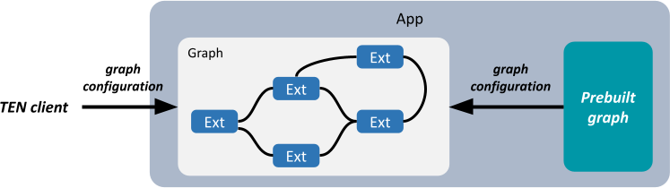

# Graph

In the TEN framework, there are two types of graphs:

1. Flexible
2. Predefined

|  | Flexible | Predefined |
|----|----|----|
| Time to start the graph | When the TEN app receives the `start_graph` command. | When the TEN app starts, or when the TEN app receives the `start_graph` command. |
| Graph content | Specified in the `start_graph` command. | Specified in the TEN app's properties. |
| Graph name | A random UUID. | Specified in the TEN app's properties. |

<figure><figcaption><p>Two Types of Graph</p></figcaption></figure>

For predefined graphs, there is an `auto_start` attribute that determines whether the predefined graph will start automatically when the TEN app starts.

## Flexible Graph

When the TEN app receives the `start_graph` command and creates this type of graph, it will assign a random UUID value as the ID of the newly started graph. If other clients obtain this graph's ID, they can also connect to this graph.

Example of a flexible graph name:

`123e4567-e89b-12d3-a456-426614174000`

## Predefined Graph

Predefined graphs are very similar to flexible graphs. The content of a flexible graph is included in the `start_graph` command, while the content of a predefined graph is defined by the TEN app. Clients only need to specify the name of the predefined graph they want to start in the `start_graph` command.

The main purpose of predefined graphs is for ease of use and information protection. Predefined graphs allow the client to avoid knowing the detailed content of the graph, which might be due to usability considerations or to prevent the client from accessing certain information that the graph contains.

Example of a predefined graph name:

`http-server`

When a TEN app starts, predefined graphs that are set to auto-start will also be initiated.

## Graph Definition

The definition of a graph, whether flexible or predefined, is the same. The following is the definition of a graph:

```json
{
  "nodes": [
    // Definition of nodes
  ],
  "connections": [
    // Definition of connections
  ]
}
```

Key points:

1. If there is only one app, the app field can be omitted. Otherwise, it must be specified. If there is only one app and the app field is not specified, the TEN runtime will default to using `localhost` as the app field.

2. The nodes field specifies the nodes within the graph, such as extensions, extension groups, etc.

3. For each node within the graph, it can only appear once in the nodes field. If it appears multiple times, the TEN framework will throw an error, either during graph validation by the TEN manager or during graph validation by the TEN runtime.

4. The way to specify an extension group within the nodes field is as follows.

   The property field is optional.

   ```json
   {
     "type": "extension_group",
     "name": "default_extension_group",
     "addon": "default_extension_group",
     "app": "msgpack://127.0.0.1:8001/",
     "property": {
       "root_key": "player",
       "extra_keys": [
         "playerName"
       ]
     }
   }
   ```

5. The way to specify an extension within the nodes field is as follows.

   The property field is optional. The addon field is also optional.

   - If the addon field is present, it indicates that the extension is an instance generated by that addon.
   - If the addon field is not present, it indicates that the extension is not generated by an addon but is created by the corresponding extension group. In such cases, it generally does not need to be explicitly defined in the nodes field, but if you want to specify its property field, it must be explicitly defined in the nodes field.

   ```json
   {
     "type": "extension",
     "name": "simple_http_server_cpp",
     "addon": "simple_http_server_cpp",
     "extension_group": "default_extension_group",
     "app": "msgpack://127.0.0.1:8001/",
     "property": {
       "root_key": "player",
       "extra_keys": [
         "playerName"
       ]
     }
   }
   ```

6. The connections field specifies the connections between nodes within the graph.

   In each connection, the values for extension and extension group are strings representing the names of the corresponding nodes.

A complete example is as follows:

```json
{
  "nodes": [
    {
      "type": "extension_group",
      "name": "default_extension_group",
      "addon": "default_extension_group",
      "app": "msgpack://127.0.0.1:8001/"
    },
    {
      "type": "extension",
      "name": "simple_http_server_cpp",
      "addon": "simple_http_server_cpp",
      "extension_group": "default_extension_group",
      "property": {
        "root_key": "player",
        "extra_keys": [
          "playerName"
        ]
      }
    }
  ],
  "connections": [
    {
      "app": "msgpack://127.0.0.1:8001/",
      "extension_group": "default_extension_group",
      "extension": "simple_http_server_cpp",
      "cmd": [
        {
          "name": "start",
          "dest": [
            {
              "app": "msgpack://127.0.0.1:8001/",
              "extension_group": "gateway_group",
              "extension": "gateway"
            }
          ]
        },
        {
          "name": "stop",
          "dest": [
            {
              "app": "msgpack://127.0.0.1:8001/",
              "extension_group": "gateway_group",
              "extension": "gateway"
            }
          ]
        }
      ]
    },
    {
      "app": "msgpack://127.0.0.1:8001/",
      "extension_group": "gateway_group",
      "extension": "gateway",
      "cmd": [
        {
          "name": "push_status_online",
          "dest": [
            {
              "app": "msgpack://127.0.0.1:8001/",
              "extension_group": "uap_group",
              "extension": "uap"
            }
          ]
        }
      ]
    }
  ]
}
```

## Definition of Predefined Graph

Essentially, you place the complete graph definition above under the `predefined_graphs` field in the app's properties. The `predefined_graphs` field will also have its attributes, such as name, auto_start, etc.

```json
"predefined_graphs": [
  {
    "name": "0",
    "auto_start": true,
    // Place the complete graph definition here.
  }
]
```

So it looks like this:

```json
"predefined_graphs": [
  {
    "name": "0",
    "auto_start": true,
    "nodes": [
      {
        "type": "extension_group",
        "name": "default_extension_group",
        "addon": "default_extension_group",
        "app": "msgpack://127.0.0.1:8001/"
      },
      {
        "type": "extension",
        "name": "simple_http_server_cpp",
        "addon": "simple_http_server_cpp",
        "extension_group": "default_extension_group",
        "property": {
          "root_key": "player",
          "extra_keys": [
            "playerName"
          ]
        }
      }
    ],
    "connections": [
      {
        "app": "msgpack://127.0.0.1:8001/",
        "extension_group": "default_extension_group",
        "extension": "simple_http_server_cpp",
        "cmd": [
          {
            "name": "start",
            "dest": [
              {
                "app": "msgpack://127.0.0.1:8001/",
                "extension_group": "gateway_group",
                "extension": "gateway"
              }
            ]
          },
          {
            "name": "stop",
            "dest": [
              {
                "app": "msgpack://127.0.0.1:8001/",
                "extension_group": "gateway_group",
                "extension": "gateway"
              }
            ]
          }
        ]
      },
      {
        "app": "msgpack://127.0.0.1:8001/",
        "extension_group": "gateway_group",
        "extension": "gateway",
        "cmd": [
          {
            "name": "push_status_online",
            "dest": [
              {
                "app": "msgpack://127.0.0.1:8001/",
                "extension_group": "uap_group",
                "extension": "uap"
              }
            ]
          }
        ]
      }
    ]
  }
]
```

## Definition of the `start_graph` Command

Essentially, you place the complete graph definition above under the `ten` field in the `start_graph` command. The `start_graph` command will also have its attributes, such as type, seq_id, etc.

```json
{
  "_ten": {
    "type": "start_graph",
    "seq_id": "55"
    // Place the complete graph definition here.
  }
}
```

```json
{
  "_ten": {
    "type": "start_graph",
    "seq_id": "55",
    "nodes": [
      {
        "type": "extension_group",
        "name": "default_extension_group",
        "addon": "default_extension_group",
        "app": "msgpack://127.0.0.1:8001/"
      },
      {
        "type": "extension",
        "name": "simple_http_server_cpp",
        "addon": "simple_http_server_cpp",
        "extension_group": "default_extension_group",
        "property": {
          "root_key": "player",
          "extra_keys": [
            "playerName"
          ]
        }
      }
    ],
    "connections": [
      {
        "app": "msgpack://127.0.0.1:8001/",
        "extension_group": "default_extension_group",
        "extension": "simple_http_server_cpp",
        "cmd": [
          {
            "name": "start",
            "dest": [
              {
                "app": "msgpack://127.0.0.1:8001/",
                "extension_group": "gateway_group",
                "extension": "gateway"
              }
            ]
          },
          {
            "name": "stop",
            "dest": [
              {
                "app": "msgpack://127.0.0.1:8001/",
                "extension_group": "gateway_group",
                "extension": "gateway"
              }
            ]
          }
        ]
      },
      {
        "extension_group": "gateway_group",
        "extension": "gateway",
        "cmd": [
          {
            "name": "push_status_online",
            "dest": [
              {
                "extension_group": "uap_group",
                "extension": "uap"
              }
            ]
          }
        ]
      }
    ]
  }
}
```

## Specification for Graph Definition

* Nodes can not be empty.

  The `nodes` array is required in a graph. And the `connections` array is optional.

* The `app` field in a node must be equal to the `_ten::uri` in the property.json of app.

  > **Note**
  >
  > * The `app` field in a node can **_NOT_** be `localhost`. You do not need to specify the `app` field if the belonging app does not have a `_ten::uri`.

* Nodes should not be duplicated.

  The elements in the Nodes list must be unique based on the app + group + name dimension. In other words, you can not specify two different addons with the same instance name in the same extension_group of app. Ex:

  ```json
  {
    "nodes": [
      {
        "type": "extension",
        "name": "some_ext",
        "addon": "addon_1",
        "extension_group": "test",
      },
      {
        "type": "extension",
        "name": "some_ext",
        "addon": "addon_2",
        "extension_group": "test",
      }
    ]
  }
  ```

  The above definition is invalid, as the `name` in two nodes are same.

  > **Note**:
  >
  > * If the `app` field is not specified, it will be `localhost` by default.
  > * The above definition is invalid, even if the `addon` in both nodes are same.

* Extensions used in connections should be defined in nodes.

  Each extension used in connections, no matter the source or dest, must be defined in the nodes. Ex:

  ```json
  {
    "nodes": [
      {
        "type": "extension",
        "name": "ext_1",
        "addon": "addon_1",
        "extension_group": "some_group"
      }
    ],
    "connections": [
      {
        "extension_group": "some_group",
        "extension": "ext_1",
        "cmd": [
          {
            "name": "hello",
            "dest": [
              {
                "extension_group": "some_group",
                "extension": "ext_2"
              }
            ]
          }
        ]
      }
    ]
  }
  ```

  In above graph, the extension `ext_2` is missing in nodes.

  > **Note**
  >
  > * Same as the second rule, each node in `nodes` and `connections` is identified by `app` + `extension_group` + `name` (i.e., the `extension` field in connections).

* In connections, messages sent from one extension should be defined in the same section.

  In other words, each extension in `connections` can only be defined in one section. Ex:

  ```json
  {
    "nodes": [
      {
        "type": "extension",
        "name": "ext_1",
        "addon": "addon_1",
        "extension_group": "some_group"
      },
      {
        "type": "extension",
        "name": "ext_2",
        "addon": "addon_2",
        "extension_group": "some_group"
      }
    ],
    "connections": [
      {
        "extension_group": "some_group",
        "extension": "ext_1",
        "cmd": [
          {
            "name": "hello",
            "dest": [
              {
                "extension_group": "some_group",
                "extension": "ext_2"
              }
            ]
          }
        ]
      },
      {
        "extension_group": "some_group",
        "extension": "ext_1",
        "data": [
          {
            "name": "hello",
            "dest": [
              {
                "extension_group": "some_group",
                "extension": "ext_2"
              }
            ]
          }
        ]
      }
    ]
  }
  ```

  The above graph is invalid, as the extension `ext_1` appears in two sections in the `connections` array, even through the messages sent out are different. The `connections` should be as follows.

  ```json
  {
    "connections": [
      {
        "extension_group": "some_group",
        "extension": "ext_1",
        "cmd": [
          {
            "name": "hello",
            "dest": [
              {
                "extension_group": "some_group",
                "extension": "ext_2"
              }
            ]
          }
        ],
        "data": [
          {
            "name": "hello",
            "dest": [
              {
                "extension_group": "some_group",
                "extension": "ext_2"
              }
            ]
          }
        ]
      }
    ]
  }
  ```

* In connections, the messages sent out from one extension should have a unique name in each type.

  Ex:

  ```json
  {
    "nodes": [
      {
        "type": "extension",
        "name": "ext_1",
        "addon": "addon_1",
        "extension_group": "some_group"
      },
      {
        "type": "extension",
        "name": "ext_2",
        "addon": "addon_2",
        "extension_group": "some_group"
      },
      {
        "type": "extension",
        "name": "ext_3",
        "addon": "addon_3",
        "extension_group": "some_group"
      }
    ],
    "connections": [
      {
        "extension_group": "some_group",
        "extension": "ext_1",
        "cmd": [
          {
            "name": "hello",
            "dest": [
              {
                "extension_group": "some_group",
                "extension": "ext_2"
              }
            ]
          },
          {
            "name": "hello",
            "dest": [
              {
                "extension_group": "some_group",
                "extension": "ext_3"
              }
            ]
          }
        ]
      }
    ]
  }
  ```

  The above graph is invalid, as the cmd name `hello` appears twice. If you want to send a `hello` cmd from `ext_1` to both `ext_2` and `ext_3`, change the connections as follows.

  ```json
  {
    "connections": [
      {
        "extension_group": "some_group",
        "extension": "ext_1",
        "cmd": [
          {
            "name": "hello",
            "dest": [
              {
                "extension_group": "some_group",
                "extension": "ext_2"
              },
              {
                "extension_group": "some_group",
                "extension": "ext_3"
              }
            ]
          }
        ]
      }
    ]
  }
  ```

  However, it's OK if two messages have the same name in different types. Ex:

  ```json
  {
    "connections": [
      {
        "extension_group": "some_group",
        "extension": "ext_1",
        "cmd": [
          {
            "name": "hello",
            "dest": [
              {
                "extension_group": "some_group",
                "extension": "ext_2"
              }
            ]
          }
        ],
        "data": [
          {
            "name": "hello",
            "dest": [
              {
                "extension_group": "some_group",
                "extension": "ext_3"
              }
            ]
          }
        ]
      }
    ]
  }
  ```

See more examples in `check graph` command in tman.
