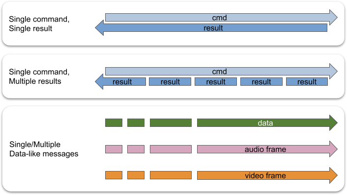

# 消息系统

## 消息类型

在 TEN 框架中，消息分为四种类型：

1.  命令
2.  数据
3.  视频帧
4.  音频帧

命令和非命令消息类型之间的主要区别在于，命令具有结果，而非命令则没有。

与这些类型相对应，扩展具有四个消息回调：

1.  `OnCmd`
2.  `OnData`
3.  `OnVideoFrame`
4.  `OnAudioFrame`

以下是 TEN 框架消息的分类图：

```text
┌── 有结果
│   └── 命令
│       ├── TEN 框架内置命令
│       │    => 消息名称以 `ten:` 开头
│       └── 非 TEN 框架内置命令
│            => 消息名称不以 `ten:` 开头
└── 没有结果
    ├── 数据
    │   ├── TEN 框架内置数据
    │   │    => 消息名称以 `ten:` 开头
    │   └── 非 TEN 框架内置数据
    │        => 消息名称不以 `ten:` 开头
    ├── 视频帧
    │   ├── TEN 框架内置视频帧
    │   │    => 消息名称以 `ten:` 开头
    │   └── 非 TEN 框架内置视频帧
    │        => 消息名称不以 `ten:` 开头
    └── 音频帧
        ├── TEN 框架内置音频帧
        │    => 消息名称以 `ten:` 开头
        └── 非 TEN 框架内置音频帧
             => 消息名称不以 `ten:` 开头
```

## 消息名称

TEN 框架中的消息名称用于区分同一类型但具有不同目的的消息。扩展使用不同的消息名称来确定它们需要采取的操作。

消息名称的命名规则如下：

1.  第一个字符必须是字母 (`a-z`、`A-Z`) 或下划线 (`_`)。
2.  后续字符可以是字母 (`a-z`、`A-Z`)、数字 (`0-9`) 或下划线 (`_`)。

## 消息流

<figure><figcaption><p>消息流</p></figcaption></figure>

TEN 框架支持三种消息流模式：

1.  **一条消息，一个结果。**

    适用于一个动作产生单个结果的情况。

2.  **一条消息，多个结果。**

    适用于一个动作产生多个结果的情况。

3.  **多条消息。**

    适用于不需要结果的动作。

## 扩展消息接口

扩展清单中的 `api` 字段表示扩展的外部消息接口。清单中的 `api` 字段可以包含以下类型的 API 信息：

*   `cmd_in`
*   `cmd_out`
*   `data_in`
*   `data_out`
*   `audio_frame_in`
*   `audio_frame_out`
*   `video_frame_in`
*   `video_frame_out`

这些 API 定义的一个例子如下：

```json
{
  "api": {
    "cmd_in": [
      {
        "name": "cmd_foo",
        "property": {
          "foo": {
            "type": "int8"
          },
          "bar": {
            "type": "string"
          }
        },
        "result": {
          "property": {
            "aaa": {
              "type": "int8"
            },
            "