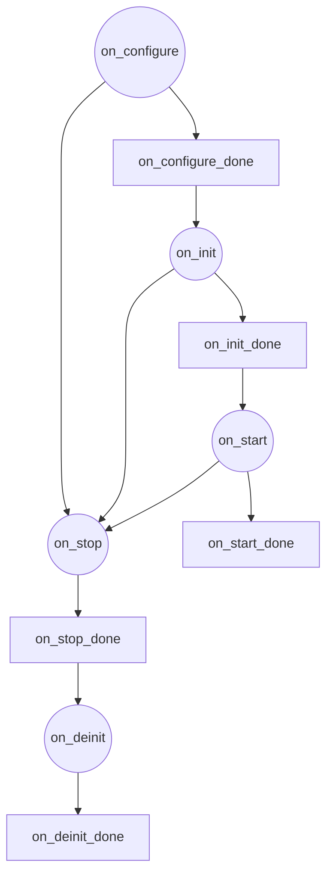
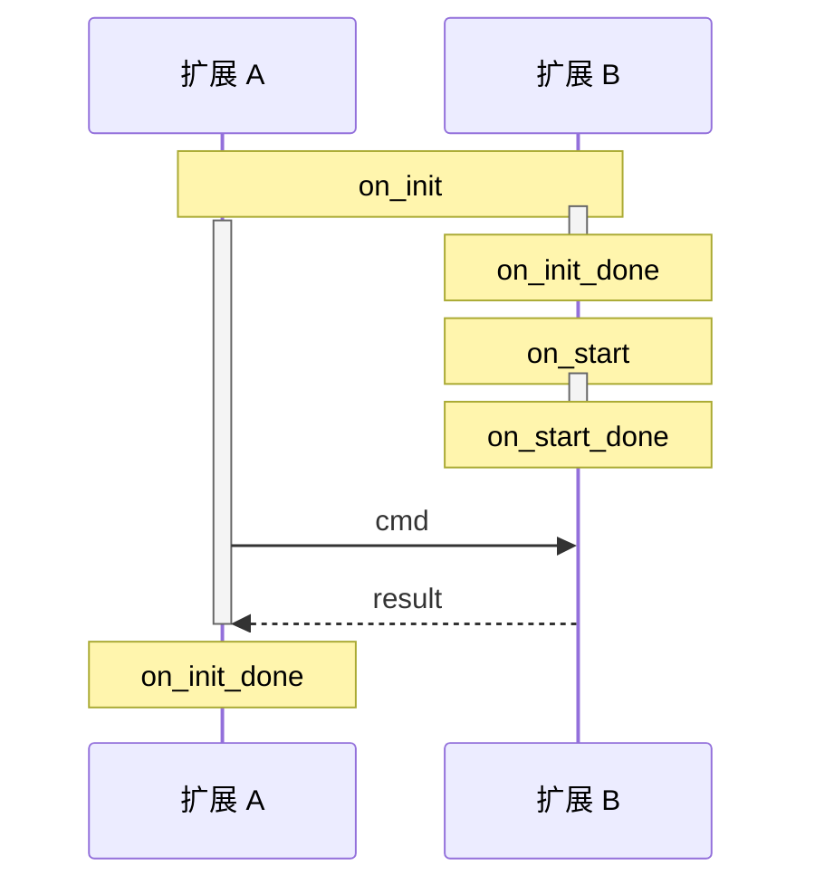
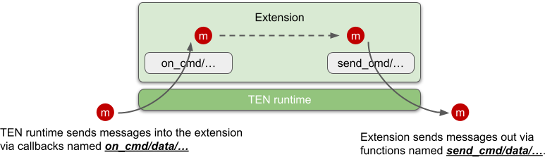

# 扩展

## 生命周期

扩展的生命周期分为以下阶段：

1.  `on_configure`
2.  `on_init`
3.  `on_start`
4.  `on_stop`
5.  `on_deinit`

在所有这些阶段，扩展都可以发送消息，如果发送的消息是命令类型，则扩展还可以接收其发送的命令的结果。换句话说，不存在扩展*不能*发送消息或接收其自身发送的命令结果的阶段。因此，在所有这些阶段，扩展都可以向其他扩展发送消息，这有助于在所有阶段实现扩展之间的依赖关系。

每个生命周期阶段都对应一个回调函数，并且有一个相应的 `on_xxx_done()` 函数来标记该生命周期阶段的结束。

| 生命周期回调 | 生命周期结束函数  |
| -------------- | ----------------- |
| `on_configure` | `on_configure_done` |
| `on_init`      | `on_init_done`      |
| `on_start`     | `on_start_done`     |
| `on_stop`      | `on_stop_done`      |
| `on_deinit`    | `on_deinit_done`    |

### 阶段转换图



### on_configure

用于设置扩展属性的初始值。这允许在其他生命周期阶段中使用 `ten_env` 的 `get_property` API 来检索在 `on_configure()` 阶段设置的属性。调用 `on_configure_done()` 函数以标记 `on_configure` 阶段的结束。

```c++
  void on_configure(ten::ten_env_t &ten_env) override {
    // 设置扩展属性的初始值。
    ten_env.init_property_from_json(
      R"({
           "_ten": {
             "uri": "msgpack://127.0.0.1:8001/",
             "log_level": 2
           }
         })", nullptr);
    ten_env.on_configure_done();
  }
```

### on_init

用于初始化扩展。由于在 `on_init_done()` 之前扩展尚未准备就绪，TEN 运行时会将发送到扩展的所有消息排队，直到它准备就绪。准备就绪后，会将排队的消息传递到扩展。重要的是要注意，如果结果来自扩展自身发送的命令，则*不受*此限制；TEN 运行时会将命令的结果直接传递回扩展。这是因为发送命令是扩展的自我启动操作，因此它必须准备好接收并处理其自身命令的结果。

### on_start

此阶段标志着运行时开始向扩展发送消息。`on_start_done` 函数没有特殊用途，但为了与其他生命周期阶段保持一致并降低学习复杂性，TEN 框架包含了它。通常，`on_start_done` 在 `on_start` 回调函数的末尾调用。TEN 运行时将在收到其 `on_start_done()` 后开始将来自其他扩展的消息传递到此扩展。

```c++
  void on_start(ten::ten_env_t &ten_env) override {
    // 一些操作。
    ten_env.on_start_done();
  }
```

### on_stop

在许多情况下需要停止扩展，例如当包含扩展的应用程序或引擎终止时。当扩展即将停止时，TEN 运行时会使用此 `on_stop` 回调通知扩展它已进入 `on_stop` 生命周期阶段。然后，扩展可以执行任何必要的终止操作。

### on_deinit

在扩展调用 `on_stop_done()` 后，它将进入 `on_deinit` 阶段。在此阶段，由于扩展内的资源可能不再完全可用，因此 TEN 运行时不会将来自其他扩展的任何消息传递到此扩展。

## 不同生命周期阶段的扩展之间的关系

基本上，没有固有的关系。每个扩展都独立运行，在其自身的生命周期阶段之间切换。扩展是彼此独立的，它们之间的任何依赖关系都必须由扩展本身显式实现。TEN 运行时不进行任何假设或保证。例如，如果扩展 A 需要等待扩展 B 完成其初始化才能完成自身的初始化，则扩展 A 可以在其 `on_init` 期间向扩展 B 发送命令。一旦扩展 B 完成初始化并收到命令，它可以回复结果，当扩展 A 收到结果时，它可以调用 `on_init_done`。



基本上，在所有其他生命周期阶段，如果想要实现不同扩展的顺序，可以使用相同的方法来实现。

## 与 TEN 运行时接口

扩展主要通过三个接口与 TEN 运行时交互：

1.  **生命周期回调**
    -   这些包括像 `on_init`、`on_deinit`、`on_start` 和 `on_stop` 这样的回调。

2.  **接收消息的回调**
    -   这些包括诸如 `on_cmd`、`on_data`、`on_audio_frame` 和 `on_video_frame` 之类的回调，用于处理传入扩展的消息。

3.  **发送消息的函数**
    -   这些包括诸如 `send_cmd`、`send_data`、`send_audio_frame` 和 `send_video_frame` 之类的函数，用于将消息发送出扩展。

## 生命周期回调

扩展生命周期的不同阶段及其与消息处理的连接如下：

-   **on_init ~ on_init_done**：处理扩展自身的初始化。在此阶段，扩展可以发送消息并接收其发送的命令的结果，但不能接收其他扩展主动发送的消息。

-   **on_start ~ on_start_done**：在此阶段，扩展可以发送消息并接收其发送的命令的结果，但不能接收其他扩展主动发送的消息。由于属性在 `on_configure` 期间初始化，因此您可以执行依赖于这些属性已设置的操作。但是，由于这仍然是初始化阶段的一部分，因此扩展不会接收由其他人启动的消息，从而避免了各种检查的需要。允许主动发送消息。

-   **after on_start_done ~ on_stop_done**：在此阶段，扩展可以正常发送和接收所有类型的消息及其结果。

-   **on_deinit ~ on_deinit_done**：处理扩展的去初始化。与 `on_init` 阶段类似，在此阶段，扩展可以发送消息并接收其发送的命令的结果，但不能接收其他扩展主动发送的消息。

## 使用不同语言实现扩展

在 TEN 框架中，可以使用各种语言（例如 C++、Go 和 Python）实现扩展。开发人员可以使用相同的概念方法来使用不同语言实现扩展。学习如何使用一种语言开发扩展使得使用其他语言也相对容易。

## 扩展中的异步消息处理

<figure><figcaption><p>异步消息处理</p></figcaption></figure>

扩展以异步方式处理消息。当 TEN 运行时通过诸如 `on_cmd`、`on_data`、`on_audio_frame` 或 `on_video_frame` 之类的回调将消息传递到扩展时，不要求扩展立即在回调中处理消息。相反，扩展可以将消息委托给其他线程、进程甚至机器进行处理。这允许充分利用多核和分布式计算资源。

处理完成后，可以使用诸如 `send_cmd`、`send_data`、`send_audio_frame` 或 `send_video_frame` 之类的回调将结果发送回 TEN 运行时。整个过程是异步的，这意味着扩展不需要在 `on_cmd`、`on_data`、`on_audio_frame` 或 `on_video_frame` 回调返回之前发送已处理的结果。可以使用适当的发送函数仅在结果真正准备好时才传输结果。
