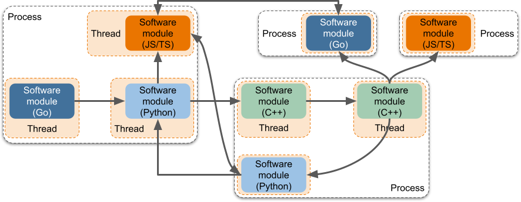
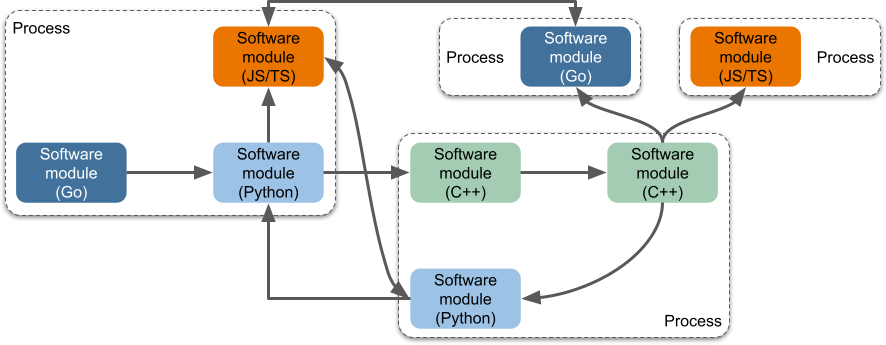

# TEN 框架概念概述

## 愿景

TEN 框架的愿景是建立一个模块化、灵活且可扩展的平台，从而提高开发速度、可维护性和可扩展性。该框架旨在支持模块化开发的最佳工程实践，使开发人员能够通过利用平台提供的全面机制来创建稳健、高效和适应性强的应用程序。

---

## 核心概念

### 模块化

1. **明确的模块边界**：该框架允许清晰地定义控制平面和数据平面的边界，这些边界可以静态声明。这有助于使用离线工具进行轻松检查和后处理。
2. **动态服务组合**：进程中的模块可以在运行时动态组合，而无需静态编译，从而实现灵活的服务配置。
3. **简化的模块集成**：在具有多个模块组合的场景中，只需要声明，而无需修改任何模块代码或编写粘合代码。
4. **分散的模块耦合**：该架构允许不同的团队独立开发模块，而无需模块间耦合，从而方便动态替换。
5. **灵活的模块接口通信**：支持两种类型的接口通信——一种要求双方参数一致，另一种允许参数存在差异并由平台提供桥接机制。这种灵活性对于独立的模块开发和部署至关重要。

### 编排

1. **有向循环图 (DCG) 拓扑**：支持复杂的图结构进行模块组合，在控制平面和数据平面中实现 1 对 n、n 对 1 和 n 对 m 的交互关系。
2. **跨进程和线程编排**：允许协调跨不同进程和线程的模块实例，形成完整的服务场景。

   <figure><figcaption>
跨进程和线程编排
</figcaption></figure>
3. **动态编排配置**：编排可以在运行时动态配置，也可以在服务执行前预先配置。

### 灵活的配置设置

1. **分层配置支持**：不同的模块实例可以具有不同的配置可能性，可以适应不同的分层上下文。
2. **多功能的配置能力**：配置可以预设、在运行时动态更改或作为更新分发。

### 多样的发布能力

1. **支持二进制和源代码发布**：模块可以以源代码或二进制形式分发，两种模式可以同时用于同一模块。
2. **与云市场的集成**：模块（无论是源代码还是二进制）都可以发布到云市场，以便轻松下载并集成到项目中。

### 多实例能力

1. **平台的多个实例**：该平台避免使用全局变量，支持在单个业务流程中运行多个实例。
2. **每个模块的多个实例**：模块的开发不依赖于全局变量，允许同一模块的多个实例运行而不会发生冲突。
3. **编排管道的多个实例**：支持在单个进程中并发或顺序执行多个编排管道。

### 多样的分发能力

1. **动态切换分发配置**：模块可以跨不同的进程和线程进行分发，以实现高可用性、高并发性和更轻松的热更新。
2. **分发配置的解耦**：分发配置与模块代码以及编译/构建过程解耦，从而简化部署。

### 输入/输出支持的灵活性

1. **支持控制平面和数据平面**：该框架支持模块之间的命令调用和原始数据传输（音频/视频/数据）。
2. **支持进程间和线程间通信**：模块可以同时处理跨进程和线程的外部输入/输出操作。
3. **RPC 本质**：外部输入/输出操作具有 RPC 特性，从而实现跨不同进程的无缝模块集成。
4. **触发多个下游组件**：单个操作可以触发多个下游模块，并将聚合的响应返回到原始模块。
5. **声明式外部输入/输出**：接口可以静态声明，允许离线工具进行静态检查。
6. **简化的外部输入/输出代码**：函数调用接口（理想情况下是自动生成的）简化了模块开发人员的编码工作。
7. **支持不可序列化的数据**：该架构支持传输不可序列化的数据，并使用工具自动识别和标记此类用法。
8. **透明的进程间通信**：底层传输逻辑由平台抽象出来，从而简化了跨进程的交互。
9. **支持同步和异步控制平面操作**：控制平面支持同步和异步交互，允许双向命令和响应流。
10. **支持受限的执行上下文**：允许同一线程中的模块之间进行同步交互。

### 自由开发模块

1. **自由使用第三方库**：模块可以自由使用第三方库来实现所需的功能。
2. **自由利用操作系统特性**：开发人员可以自由地在模块内创建和终止本机线程，从而提供最大的开发灵活性。

### 编程语言支持

1. **支持多种编程语言**：该框架支持用各种语言（例如，C/C++、Go、Java、Python）编写的模块，从而实现多样化的开发环境。

   <figure><figcaption>
编程语言支持
</figcaption></figure>
2. **跨语言模块集成**：用不同语言编写的模块可以在同一进程中一起运行。
3. **跨语言的统一交互**：模块在不同的语言中具有一致的接口和行为。
4. **跨语言的统一数据类型**：该平台提供统一的数据类型，确保不同编程语言之间的数据交换一致。

### 丰富的外部交互能力

1. **UI 提供程序**：该架构支持后端服务为前端提供 UI 组件。
2. **RESTful 接口**：后端服务可以公开 RESTful 接口以供客户端交互。
3. **与现有服务的非侵入式集成**：该框架可以集成到现有服务中，而无需完全重写。
4. **单线程操作**：该框架可以作为独立的进程或现有服务中的线程运行，从而避免与现有业务逻辑冲突。

### 测试友好

1. **多样化的测试机制**：该框架支持各种测试策略，包括单元测试、集成测试、模块测试和黑盒测试。
2. **独立的模块测试**：模块可以独立测试，从而有助于进行全面有效的测试。

### 离线处理能力

1. **包管理器**：该框架包括 CLI 和包管理器，用于管理模块及其组合。
2. **编排工具**：提供 GUI 工具用于离线开发和编排，从而增强开发人员的体验。
3. **可视化调试工具**：该架构支持可视化调试工具，以帮助可视化模块交互。

### 健壮性

1. **编排管道的高并发**：该平台支持在单个进程中至少 100 个编排管道的并发实例。
2. **RESTful 接口的高并发**：该平台可以在单个进程中支持超过 20,000 个 RESTful 客户端。
3. **非 RESTful 接口的高并发**：该平台可以在单个进程中支持超过 1,000 个非 RESTful 客户端。

---

## 应用场景

TEN 框架旨在使 AI 功能集成和应用程序开发更加高效和灵活。开发人员可以快速创建和部署 AI 功能扩展，并将它们组合起来形成自定义的应用程序或服务。典型的 AI 场景包括：

- **智能语音处理**：语音识别 (STT)、语音合成 (TTS) 和情感分析的扩展可以组合起来创建会话系统。
- **视觉识别系统**：图像识别和视频分析的扩展可用于构建具有人脸识别、物体检测和运动跟踪的安全或零售解决方案。
- **推荐系统和数据分析**：机器学习和数据处理的扩展可以组合起来创建个性化推荐系统和分析工具。
- **互动教育和培训平台**：互动教学、智能辅导和评估的扩展可以组装成全面的教育技术解决方案。
- **健康监测和诊断系统**：医学图像分析和 AI 驱动的诊断扩展可用于开发用于疾病监测和早期诊断的系统。

通过 TEN 框架，开发人员可以创建、共享和扩展 AI 扩展，从而实现快速开发和创新。灵活的架构确保了可扩展性和可维护性，为现代 AI 解决方案奠定了坚实的基础。
